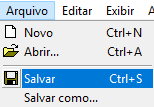
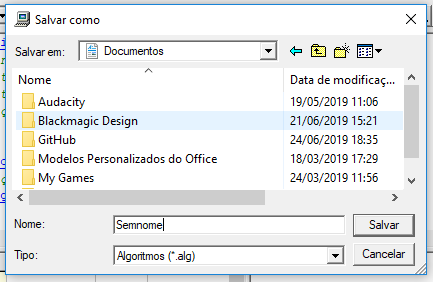
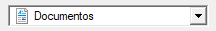
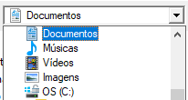
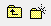
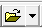
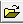
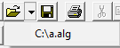
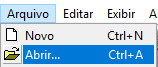
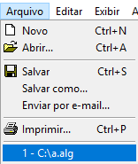

# Parte 1: Como Instalar e Utilizar o VisuAlg
Para instalar o VisuAlg 2.5 (a versão que será utilizada), utilize [este link.](). 
Para encontrar outras versões, [pesquise na internet](https://www.google.com.br/search?q=visualg+download) ou utilize [o repositório oficial no SourceForge]().

O manual oficial da versão 2 do VisuAlg está disponível [no site da UFSC](http://www.inf.ufsc.br/~bosco.sobral/ensino/ine5201/Visualg2_manual.pf).

---

Ao abrir o **VisuAlg 2.5**, nos deparamos com uma tela similar a essa:

Antes de tudo, deve-se saber como *criar, salvar e abrir arquivos*. Trabalharemos com esta parte da barra de ferramentas (localizada no topo):

## Criando um Arquivo

Ao abrir o VisuAlg, um arquivo novo já é criado, com o código inicial.

Para criar um arquivo novo sem ter que abrir o VisuAlg novamente, utilize o botão ``novo`` na barra de ferramentas ou clique na barra de menu ``Arquivo > Novo``. Você pode também utilizar a combinação de teclas ``Ctrl + N``.

 ou 

## Salvando um Arquivo

Para salvar um arquivo, utilize: 
- Barra de Ferramentas: ``salvar``  
- Atalho de Teclado: ``Ctrl + S``
- Barra de Menu: ``Arquivo > Salvar`` ou ``Arquivo > Salvar Como`` (a diferença será explicada um pouco mais à frente.) 

Se é a sua primeira vez tentando salvar o arquivo, uma janela como essa irá aparecer: 

Através dela, é possível escolher o lugar onde o arquivo será salvo. Clique na parte do topo onde mostra a pasta () e algo como isso aparecerá, onde você pode escolher uma pasta principal para entrar: 

Após escolher isso, você pode escolher uma pasta na qual você estará salvando o arquivo. Mas antes disso, saiba de alguns botões especiais:  
- O primeiro é o botão **"Pasta Acima"**, que faz com que você volte para a pasta em que está a pasta atual. Por exemplo, você está em ``Documentos/Visualg/Arquivos``. Ao clicar esse botão, você vai para ``Documentos/Visualg/``. 
- O segundo botão é o **"Criar Pasta"**, onde você poderá colocar seus arquivos.

Após escolher o lugar de salvar e o nome do arquivo (com o campo ), clique no botão **Salvar** e o arquivo será salvo.

Na barra de menu, existem dois tipos de "Salvar" diferentes: **"Salvar"** (equivalente ao botão da barra de ferramentas ) e **"Salvar Como"**. 
 
Ao apertar o botão **salvar**, a janela de "Salvar Como" (para escolher o lugar onde se salva o arquivo) só aparecerá uma vez, e nas outras vezes que o botão for apertado o arquivo já será salvo no mesmo lugar. Já se o botão **salvar como** for apertado, a janela sempre aparecerá e será possível sempre escolher o lugar.

## Abrindo um Arquivo

Para abrir um arquivo, assim como para criar ou salvar um arquivo, podemos utilizar diversos métodos: 
- Barra de Ferramentas: ``abrir``  
- Atalho de Teclado: ``Ctrl+A``
- Barra de Menu: ``Arquivo > Abrir`` ou ``Arquivo > Recente``.

Na barra de ferramentas, pressione o botão com o ícone de pasta  para abrir uma janela similar à de salvar arquivo e escolher um arquivo para abrir. 
É possível ver uma lista de arquivos recentes com o ícone de seta para baixo logo ao lado , fazendo com que apareça então esta lista, onde é possível abrir tal arquivo recente: 
 
Lembre-se que, se o arquivo for movido ou estiver em um pendrive que foi desconectado, não será possível abrí-lo nesta lista.

Na barra de menu, é possível fazer o mesmo através do botão ``abrir`` ou da área em que ficam os arquivos recentes:
 
