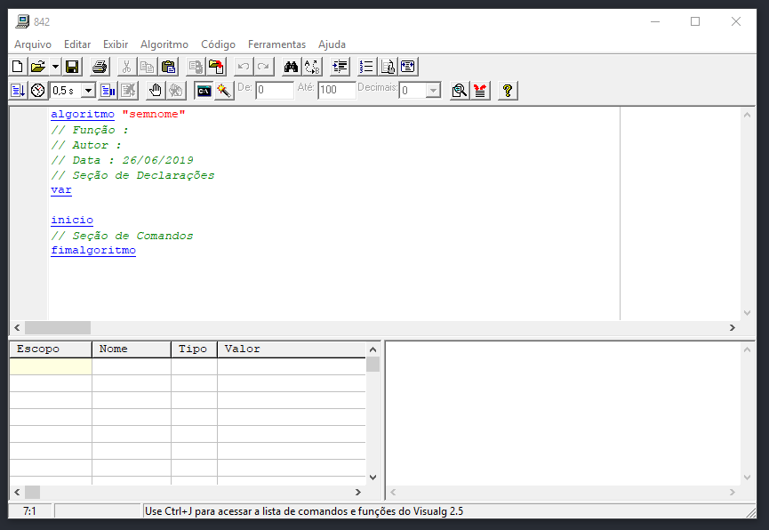
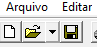
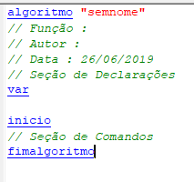
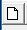
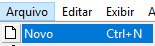
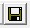

# Parte 1: Como Instalar e Utilizar o VisuAlg
Para instalar o VisuAlg 2.5 (a versão que será utilizada), utilize [este link.](). 
Para encontrar outras versões, [pesquise na internet](https://www.google.com.br/search?q=visualg+download) ou utilize [o repositório oficial no SourceForge]().

O manual oficial da versão 2 do VisuAlg está disponível [no site da UFSC](http://www.inf.ufsc.br/~bosco.sobral/ensino/ine5201/Visualg2_manual.pf).

---

Ao abrir o **VisuAlg 2.5**, nos deparamos com uma tela similar a essa:

Antes de tudo, deve-se saber como *criar, salvar e abrir arquivos*. Trabalharemos com esta parte da barra de ferramentas (localizada no topo):

## Criando um Arquivo

Ao abrir o VisuAlg, um arquivo novo já é criado, com o código inicial.

Para criar um arquivo novo sem ter que abrir o VisuAlg novamente, utilize o botão ``novo`` na barra de ferramentas ou clique na barra de menu ``Arquivo > Novo``. Você pode também utilizar a combinação de teclas ``Ctrl + N``.

## Salvando um Arquivo

Para salvar um arquivo, utilize: 
- Barra de Ferramentas: ``novo`` 

- Barra de Menu: ``Arquivo > Salvar`` ou ``Arquivo > Salvar Como`` (a diferença será explicada um pouco mais à frente.)