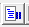
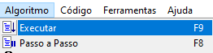
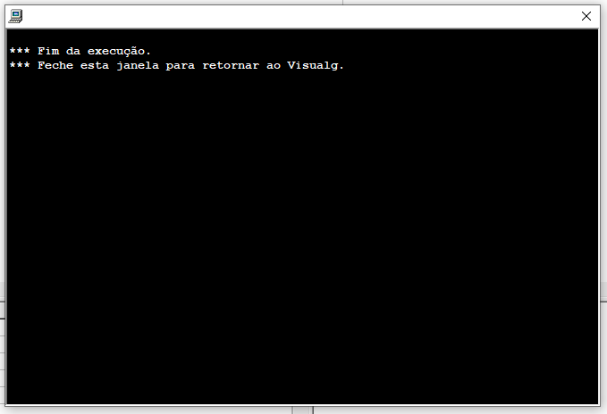
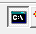
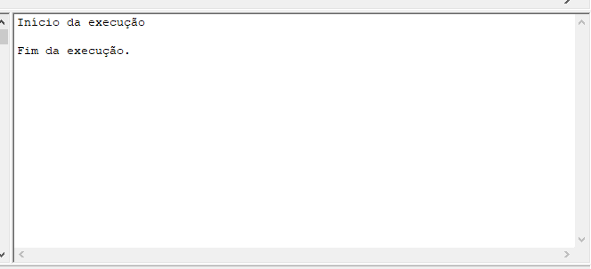

# Parte 2: Estrutura do Código no VisuAlg

Esta parte do guia ensina como funciona a estrutura do código no VisuAlg e alguns dos principais comandos.<br>
É recomendado que se leia tudo em ordem, mas não existem complicações em ler os pedaços. Lembre-se de prestar atenção nos comentários de códigos para entender como funciona direito.

---

## Introdução ao Código

Ao abrir o VisuAlg, tem-se o seguinte código:
```c
algoritmo "semnome"
// Função :
// Autor :
// Data : 30/06/2019
// Seção de Declarações 
var

inicio
// Seção de Comandos 
fimalgoritmo
```
Todo código é executado de cima para baixo. A linha 1 vem antes da linha 2, que vem antes da linha 3, e assim em seguida.

### ``algoritmo "semnome"``
Este é o código que inicia o programa; no lugar de ``"semnome"`` pode-se colocar o nome do programa (mas isso não muda nada no funcionamento do código).<br>Exemplo:
```c
algoritmo "primeiro-programa"
```

### ``// Comentários``
São anotações em um código. Elas servem para esclarecer coisas e anotar informações, mas não afetam o código.<br>Exemplo:
```c
// Este é um comentário em uma linha.
algoritmo "primeiro-programa" // Este é um comentário no fim de uma linha. Tudo depois do "//" não é executado e é ignorado durante o funcionamento do programa.
```

### ``var``
Este é um local onde é possível criar as variáveis que serão utilizadas ao decorrer do programa. Variáveis são espaços na memória do programa que podem receber valores, que poderão ser alterados e utilizados no programa.
```c
var a, b : inteiro
	h30, d : real
	e, teste : caractere
	uw4, o3wo : logico
```
O VisuAlg 2.5 aceita quatro tipos de variáveis diferentes:

- ``inteiro``: números inteiros, sem casas decimais.<br>Exemplo: ``2``
- ``real``: números reais. Podem ter ou não casas decimais, já que os números inteiros são um subconjunto dos números reais.<br>Outra coisa a se ressaltar é que se utiliza ``.`` ao invés de ``,`` para as casas decimais:<br>Exemplo: ``2``, ``5.0``, ``16.43``
- ``caractere``: conhecido como *string* na maioria das linguagens de programação - ou ainda *"cadeia de caracteres"* em português, se refere a qualquer tipo de texto. Esse texto deve ficar entre aspas.<br>Nota: números podem ser colocados dentro de um caractere, mas eles não poderão ser utilizados para expressões matemáticas.<br>Exemplo: ``"olá, mundo!"``, ``"eu comprei 64209 folhas de papel"`` ou até ``"a"`` ou ``"5"``.
- ``logico``: conhecido como *boolean* (ou *"booleano"*, aportuguesando) em outras linguagens, é um valor que só pode ser ``verdadeiro`` ou ``falso``. 

---

## Expressões Aritméticas, Relacionais e Lógicas
As expressões (e os operadores) podem servir, na programação, para diversas situações. Eles serão explorados mais à frente no documento, mas é bom fazer uma introdução a eles primeiro.

### Expressões Aritméticas
São expressões que envolvem os **operadores aritméticos**, utilizados em cálculos com números.

***Nota**: A coluna "Ordem" na tabela abaixo mostra a ordem de precedência na qual o VisuAlg executa as operações no código. Se dois operadores tem a mesma ordem de precedência, o mais à esquerda terá a precedência.*

| Símbolo | Ordem | Significado | Exemplo(s) | Resultado(s) |
| --- | :---: | --- | --- | --- |
| `()` | 1 | **Parênteses** - Priorizam cálculos. | `(4 + 3)` | ``7`` |
| `pot(base, expoente)` ou `base ^ expoente` | 2 | **Potenciação** - Faz uma potenciação com os valores dados. | `pot(2, 3)`<br>`3 ^ 2` | ``8``<br>``9``
| `raizq(x)` | 2 | Faz a **raiz quadrada** do valor entre os parênteses. | `raizq(25)`<br>``raizq(81)`` | ``5``<br>``9`` |
| `*` | 3 | **Multiplicação** | `2 * 3` | ``6`` |
| `/` | 3 | **Divisão**; retorna erro ao tentar dividir por 0. | `10 / 4`<br>``5 / 0`` | ``2.5``<br>``<erro>`` |
| `div` | 3 | **Divisão Inteira**: retorna o quociente da divisão inteira, que é uma divisão que não inclui a parte das casas decimais. | `5 div 2`| ``2`` |
| `%` | 3 | **Módulo da Divisão**: é o resto da divisão inteira. Só funciona com números inteiros, mesmo que o número real seja com casa decimal igual a 0 (ex.: ``2.0``) | `5 % 2`<br>``4.0 % 2`` | ``1``<br>``4.0`` |
| `+` | 4 | **Soma** | `5 + 3` | ``8`` |
| `-` | 4 | **Subtração** | `3 - 3` | ``0`` |

### Expressões Relacionais
São expressões que envolvem os **operadores relacionais**, que servem para comparar valores.<br>
Esses valores podem ser expressões (ex.: ``2 + 3``) que resultam em um valor ou valores em si (ex.: ``5``).<br>
Mas algo que deve ser lembrado é que **os valores devem ser do mesmo tipo**. Um inteiro não pode ser comparado a um caractere, pelo menos no VisuAlg.

***Nota**: Não há ordem de precedência para estes operadores; eles são executados da esquerda para a direita na linha, mas podem ser priorizados utilizando os parênteses.*

| Símbolo | Ordem | Significado | Exemplo(s) | Resultado(s) |
| --- | :---: | --- | --- | --- |
| ``=`` | Nenhuma<br> | **"Igual"** - Verifica se os dois lados são iguais.<!--<br>Curiosidade: em algumas linguagens de programação mais comuns, é utilizado o símbolo ``==``.--> | ``4 = 2 + 2``<br>``"abc" = "abc"``<br>``(2 > 1) = verdadeiro`` | ``verdadeiro``
| ``>`` | Nenhuma | **"Maior que"** | ``1 > 5`` | ``verdadeiro``
| ``<`` | Nenhuma | **"Menor que"** | ``5 < (3 + 3)`` | ``falso``
| ``>=`` | Nenhuma | **"Maior ou igual a"** | ``1 + 3 >= 4``<br>Uma coisa a notar aqui é que primeiramente a expressão aritmética ``1 + 3`` será resolvida para depois se resolver a expressão relacional. | ``verdadeiro``
| ``<=`` | Nenhuma | **"Menor ou igual a"** | ``1 + 3 <= 4`` | ``verdadeiro``
| ``<>`` | Nenhuma | **"Diferente"** - Verifica se os dois lados são diferentes.<!--<br>A maioria das linguagens de programação atuais utilizam o ``!=``, mas este não é o caso do VisuAlg.--> | ``1 <> 1 * 1`` | ``falso``

### Expressões Lógicas
Eles servem para combinar ou alterar valores lógicos.

| Símbolo | Ordem | Significado | Exemplo | Resultado |
| --- | :---: | --- | --- | --- |
| ``e`` | 1 | **Operador Conjuntivo**: retorna verdadeiro somente se os dois valores forem verdadeiros, ou seja, se ``valor 1`` for verdadeiro **e** ``valor 2`` for verdadeiro.<!--<br>Em outras linguagens, utiliza-se geralmente ``and`` (versão em inglês) ou ``^``--> | ``verdadeiro e falso`` | ``falso`` |
| ``ou`` | 2 | **Operador Disjuntivo**: retorna verdadeiro se pelo menos um deles for verdadeiro, ou seja, se ``valor 1`` for verdadeiro **ou** ``valor 2`` for verdadeiro.<!--<br>Em outras linguagens geralmente se utiliza ``or``.--> | ``falso ou 2 > 1`` | ``verdadeiro`` |
| ``nao`` | 3 | **Operador Negativo**: retorna o contrário de um valor.<!--<br>Em outras linguagens é mais comum o uso de ``not``, mas às vezes também ``~`` ou ``¬``.--> | ``nao (5 % 2 = 1)`` | ``falso`` |

### Tabela da Verdade
É um tipo de tabela utilizada para fazer a verificação de como funciona um operador.<br>
Exemplo de como funciona a tabela da verdade do operador ``e``:

| ``a`` | ``b`` | ``a e b`` |
| --- | --- | --- |
| ``verdadeiro`` | ``falso`` | ``falso`` |
| ``verdadeiro`` | ``verdadeiro`` | ``verdadeiro`` |
| ``falso`` | ``verdadeiro`` | ``falso`` |
| ``falso`` | ``falso`` | ``falso`` |

---

**Agora voltando ao código propriamente dito no VisuAlg:**

### ``inicio`` e ``fimalgoritmo``
O comando ``inicio`` indica o início da parte em que se pode colocar definições de variáveis (atribuir valores) e em que se coloca o código propriamente dito com o funcionamento do programa.<br>
O comando ``fimalgoritmo`` termina o programa inteiro, e por isso nenhum comando deve ser colocado depois dele.
```c
inicio
// Seção de Comandos
fimalgoritmo
```

## Testando o Código

Para testar o código, utilize o botão ``Executar`` na barra de ferramentas , a barra de menu (``Algoritmo > Executar``) ou aperte ``F9``.<br>
Para habilitar/desabilitar a execução passo-a-passo, utilize o botão ``Passo-a-passo`` na barra de ferramentas , a barra de menu (``Algoritmo > Passo a Passo``) ou aperte ``F8``.<br>


Se você não colocou nenhum código novo até agora, o programa não mostrará nada.<br>


Outra coisa para ressaltar é que é possível executar o código sem que apareça o *console* (a "tela preta").<br>
Aperte o botão  para ativar ou desativá-lo. Se desativado, o programa será executado na seção inferior direita do aplicativo:<br>


## Comandos e Funções

### Utilizando ``<-`` para definir variáveis
Para atribuir valores a variáveis, podemos utilizar o operador ``<-``.<br>Exemplo:
```c
a <- -5
b <- 23
h30 <- 5.2
d <- 3 - 10 // Os valores podem ser também resultados de expressões. Neste caso, -7.
e <- "pedra"
teste <- "aa4cgfoDc#!@$" + "jajaja"
uw4 <- verdadeiro
o3wo <- 5 > 10 // Neste caso, o o3wo vai receber o valor de falso.
```
Note que os valores devem ser dos tipos que foram <a href="#var">declarados lá na seção ``var``.</a>

### ``escreva()`` e ``escreval()`` <a id="escreva"></a> <a id="escreval"></a> 
O comando ``escreva()`` mostra na tela o que estiver entre parênteses (leia os comentários no código, pois eles ensinam as diversas maneiras de se utilizar este comando):
```c
escreva("Olá, mundo!")
escreva("Este" + " é" + " " + "um texto " + "quebrado " + e) // Como a variável e, que tem "pedra" como valor, também é um caractere, ela pôde ser somada aqui dentro.
// O comando escreva("a" + 3) não funcionaria porque não se pode somar valores de tipos diferentes. Para fazer isso, utiliza-se:
escreva("a", 3) // Deste modo, o resultado será "a 3"

escreva("a" + e) // Resulta em "apedra", pois não tem espaço entre os dois valores.
escreva("a " + e) // Resulta em "a pedra", já que tem um espaço entre eles.
escreva("a", 3) // Por algum motivo, números (inteiros e reais) já vem com um espaço na esquerda, então o resultado deste será "a 3", como mostrado acima. Não é necessário utilizar um espaço a mais.
escreva("a", 3:1:2) // Aqui o resultado será "a3.00", pois o :1:3 adicionado ao 3 indica que ele não terá espaço antes e terá duas casas decimais. Mais detalhes de como funciona isso:
// Consideremos x:y:z
// x é a variável. Ela deve ser um número, seja inteiro ou real.
// y é a quantidade de espaços. Se for 1, a quantidade de espaços será 0; se for 2, a quantidade de espaços será 1; e assim em seguida. Como uma pequena curiosidade, se o número for 0 ou menos, ao invés de ocorrer um erro, o VisuAlg simplesmente usará o padrão, que é um espaço no número.
// z é a quantidade de casas decimais. Se for 0 ou menos, nenhuma casa decimal será mostrada.
```

Porém, existe um problema ao utilizar o ``escreva()``: comandos respectivos saem na mesma linha. No caso, o resultado do programa com este código seria:
```
Início da execução
Olá, mundo!Este é um texto quebrado pedraa 3apedraa pedraa 3a3.00
Fim da execução.
```
Para resolver este problema, existe o comando ``escreval()`` (*"escreva linha"*). Ele cria uma nova linha após ser executado, fazendo com que o próximo comando saia em outra linha. Assim, o resultado deste comando será:
```
Início da execução
Olá, mundo!
Este é um texto quebrado pedra
a 3
apedra
a pedra
a 3
a3.00

Fim da execução.
```
Note que esta última linha vazia antes de "Fim da execução." foi criada por causa do último ``escreval()`` para resolver esse problema, basta trocar apenas o último ``escreval()`` por ``escreva()``.

### ``leia()``
Este comando serve para pegar receber um valor digitado pelo usuário. Dentro dos ``()`` deve ser colocado o nome das variáveis para onde o que for digitado vai. Se a variável tiver um valor antes do comando, ele será substituído pelo que for digitado.
```c
leia(a) // Como a é inteiro, o programa só irá aceitar o que for digitado se for um número inteiro.
leia(a, e) // O programa primeiro pedirá o valor de a (inteiro). Depois, em outra linha, ele pedirá o valor de e (caratere).
```

Algo que deve ser notado é que o programa não irá perguntar nada, simplesmente dar espaço para o usuário digitar. Por isso, é sempre bom colocar um ``escreva()`` ou ``escreval()`` antes:
```c
escreva("Digite o valor de a: ")
leia(a)
// A combinação destes dois fará com que o usuário possa digitar na mesma linha. Demonstração:
// Digite o valor de a: valordea

escreval("Digite o valor de a: ")
leia(a)
// Nesta combinação, ao usar o escreval, o usuário poderá digitar na outra linha. Demonstração:
// Digite o valor de a:
// valordea
```

---

## Indentação
**Indentação**, no mundo da computação, se refere a espaços grandes criados com a tecla ``tab``. Eles servem principalmente para colocar um código "dentro" de outro, em espaços uniformes. Exemplo:
```
este é um texto sem identação
	apertando tab no início desta linha, foi possível adicionar um espaço de identação nele.
	também é possível	adicionar	tabulações	no meio da linha	fazendo	tabelas:

a	boo	c
de	el	feg

os		espaços		são			uniformes
e		se			auto-		ajustam
```
Isso será útil nas estruturas de código mostradas à frente.

---

## Estruturas de Código
Estruturas de código são, como o nome diz, estruturas feitas de código. Elas possuem diversas utilidades, e nelas geralmente pode-se colocar mais código (o principal motivo para qual a identação é utilizada na programação).

### Estruturas de Seleção (``se``, ``senao``)
As estruturas de seleção permitem que um bloco de código (conjunto de código que estiver dentro desta estrutura) seja executado com base em uma ou mais condições lógicas, ou seja, se o que for pedido for verdadeiro.

1. As **Estruturas de Seleção Simples** (utilizando ``se``) são executadas simplesmente se o que foi pedido foi verdadeiro:
```c
se (condicao) entao
	// Código dentro
fimse
```
O ``se`` inicia a estrutura.<br>
Dentro dos parênteses, onde fica a ``condicao``, deve-se colocar a expressão lógica (ex.: ``10 > 4``) ou valor lógico (``verdadeiro`` / ``falso``) e a partir disso, se for verdadeiro, o código que está dentro será executado.<br>
Como explicado, ``// Código dentro`` é o lugar onde deverá ficar o código. Por questões de organização, é muito recomendado que se indente o que estiver dentro. Em algumas linguagens de programação (não é o caso do VisuAlg, mas é, por exemplo, do *Python*), a indentação é obrigatória nestes casos.<br>
O ``fimse`` indica a conclusão do código.<br><br>
Exemplo de código utilizando esta estrutura:
```c
escreva("Digite o valor de a: ")
leia(a)
se (a > 0) entao
	escreva("A é maior que 0.")
fimse
```
<br>
**Curiosidade:** o ``se`` é o equivalente de ``if`` na maioria das linguagens de programação.

2. As **Estruturas de Seleção Composta** (utilizando ``se`` e ``senao``) providenciam suporte para executar se uma coisa se aquilo foi verdadeiro, porém dando também suporte para executar algo se aquilo não for verdadeiro.
```c
se (condicao) entao
	// Código executado se a condição for verdadeira.
senao
	// Código executado se a condição for falsa.
fimse
```
**Situação Extra**:
```c
escreva("Digite o valor de a: ")
leia(a)
se (a = 1) entao
	a <- 0
	escreval("A era igual a 1 e se tornou 0.")
fimse
se (a <> 1) entao
	a <- 1
	escreval("A não era 1, mas agora é.")
fimse
```
```c
escreva("Digite o valor de a: ")
leia(a)
se (a = 1) entao
	a <- 0
	escreval("A era igual a 1 e se tornou 0.")
senao
	a <- 1
	escreval("A não era 1, mas agora é.")
fimse
```
Esta situação pode confundir muito a início, pois existe uma diferença entre estes códigos, e provavelmente é o principal motivo da existência do ``senao``: **no primeiro bloco**, o ``a`` (se for igual a 1) será transformado em 0; porém, logo depois, com a outra estrutura ``se``, ele acaba (já que 0 é diferente de 1) sendo transformado em 1 de volta, e o código acaba se tornando completamente inútil.<br>
Já **no segundo bloco**, com o ``senao``, se a primeira condição for verdadeira, o seu contrário não é verificado depois. O código no ``senao`` só é executado se, ao verificar no ``se``, a condição for falsa.
<br><br>
**Curiosidade:** o ``senao`` é o equivalente de ``else`` na maioria das linguagens de programação.

3. As **Estruturas de Seleção Encadeada** (utilizando ``se`` e ``senao`` + ``se``) são uma adaptação/mistura das duas estruturas mencionadas acima que permitem que múltiplas condições sejam verificadas ao mesmo tempo.
```c
se (condicao1) entao
	// Código executado se a condição 1 for verdadeira.
senao
	se (condicao2) entao
		// Código executado se a condição 1 for verdadeira e a condição 2 for falsa.
	senao
		// Código executado se a condição 1 e a 2 forem falsas.
	fimse // Fim da estrutura de dentro
fimse // Fim da estrutura de fora
```
Exemplo de uso:
```c
escreva("Digite o valor de a: ")
leia(a)
se (a > 0) entao // Se a for maior que 0.
	escreval("A é maior que 0.")
senao
	se (a = 0) entao // Se a for igual a 0.
		escreval("A é igual a 0.")
	senao
		// Se a não é nem maior nem igual a 0, ele é menor que 0.
		escreval("A é menor que 0.")
	fimse
fimse
```
É possível encadear (ou aninhar) - ou seja, juntar código dentro - quantas vezes for necessário:
```c
se (condicao1) entao
	// condicao1 = verdadeiro
senao
	se (condicao2) entao
		// condicao1 = falso; condicao2 = verdadeiro
	senao
		se (condicao3) entao
			// condicao1 e condicao2 = falso; condicao3 = verdadeiro
		senao
			// condicao1, condicao2 e condicao3 = falso
		fimse
	fimse
fimse
```
<br>
**Curiosidade:** existe um equivalente menor na maioria das linguagens de programação chamado ``else if`` ou ``elif``. Infelizmente, ele não está presente no VisuAlg 2.5.

---

O código montado pelas principais partes mostradas neste documento é:
```c
// Este é um comentário em uma linha.
algoritmo "primeiro-programa" // Este é um comentário no fim de uma linha. Tudo depois do "//" não é executado e é ignorado durante o funcionamento do programa.

var a, b : inteiro
	h30, d : real
	e, teste : caractere
	uw4, o3wo : logico

inicio
// Início da seção de comandos
a <- -5
b <- 23
h30 <- 5.2
d <- 3 - 10
e <- "pedra"
teste <- "aa4cgfoDc#!@$" + "jajaja"
uw4 <- verdadeiro
o3wo <- 5 > 10

escreva("Olá, mundo!")
escreva("Digite o valor de a (numero inteiro): ")
leia(a)

escreva("Digite o valor de a: ")
leia(a)
se (a > 0) entao // Se a for maior que 0.
	escreval("A é maior que 0.")
senao
	se (a = 0) entao // Se a for igual a 0.
		escreval("A é igual a 0.")
	senao
		// Se a não é nem maior nem igual a 0, ele é menor que 0.
		escreval("A é menor que 0.")
	fimse
fimse

// Fim da seção de comandos
fimalgoritmo
```

---

## Aguardando...
- [ ] Estruturas de Repetição ``(Ainda não ensinado)``:
	- [ ] Introdução às estruturas de repetição;
	- [ ] Repetição com teste no início;
	- [ ] Repetição com teste no final;
	- [ ] Repetição com variável de controle.